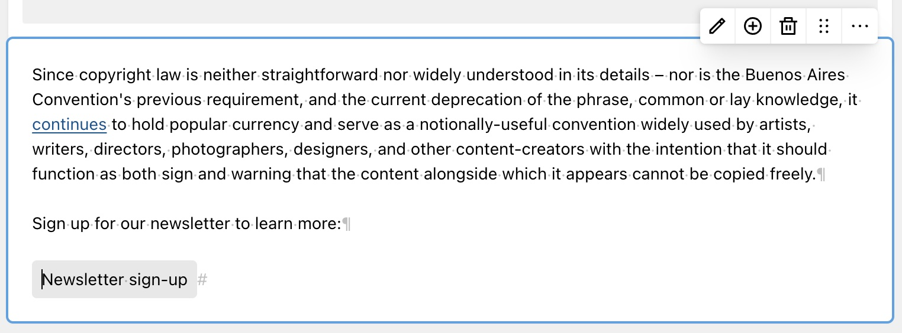
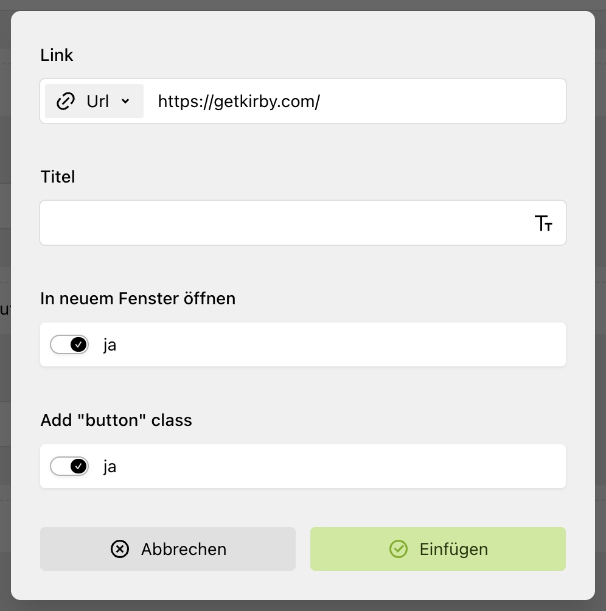

# Kirby Writer Link Extended

This plugin extends the core [Kirby Writer](https://getkirby.com/docs/reference/panel/fields/writer) Link dialog. It allows to toggle a "button" class on the rendered link. It's very specific and more of a proof of concept how to extend/modify the dialog at all.

## Installation

`composer require hansipete/writer-link-extended`

## Screenshots

## License

MIT License © 2024 [Hans Kadel](https://github.com/hansipete)
